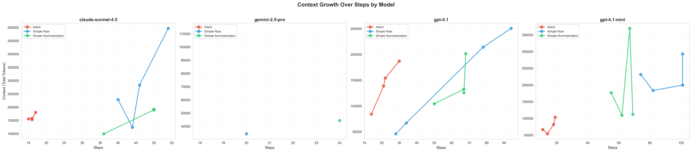

# Agent Performance Analysis Report

> Comprehensive comparison of different agent architectures for data analysis tasks

## Table of Contents

- [Overview](#overview)
- [Success Rate](#success-rate)
- [Performance Metrics](#performance-metrics)
- [Detailed Analysis](#detailed-analysis)
- [Key Insights](#key-insights)
- [Recommendations](#recommendations)

---

## Overview

**Total Runs Analyzed:** 39  
**Agent Types:** 3  
**Total Cost:** $12.43  
**Date:** 2025-11-07

**Models Tested:** `anthropic-claude-sonnet-4.5`, `openai-gpt-4.1-mini`, `google-gemini-2.5-pro`, `openai-gpt-4.1`

### Quick Stats

| Agent Type | Model | Runs | Success Rate | Avg Cost | Avg Time | Avg Steps |
|------------|-------|------|--------------|----------|----------|----------|
| `intent` | `claude-sonnet-4.5` | 4 | 100.0% | $0.34 | 193.5s | 16.0 |
| `intent` | `google-gemini-2.5-pro` | 1 | 100.0% | $0.15 | 196.7s | 18.0 |
| `intent` | `gpt-4.1` | 4 | 100.0% | $0.32 | 215.6s | 21.8 |
| `intent` | `gpt-4.1-mini` | 4 | 100.0% | $0.05 | 108.4s | 15.5 |
| `simple-raw` | `claude-sonnet-4.5` | 4 | 100.0% | $0.92 | 125.5s | 46.0 |
| `simple-raw` | `google-gemini-2.5-pro` | 1 | 100.0% | $0.12 | 111.9s | 20.0 |
| `simple-raw` | `gpt-4.1` | 4 | 100.0% | $0.33 | 94.4s | 58.5 |
| `simple-raw` | `gpt-4.1-mini` | 4 | 25.0% | $0.10 | 99.9s | 89.5 |
| `simple-summarization` | `claude-sonnet-4.5` | 4 | 50.0% | $0.58 | 202.9s | 46.5 |
| `simple-summarization` | `google-gemini-2.5-pro` | 1 | 100.0% | $0.16 | 123.4s | 24.0 |
| `simple-summarization` | `gpt-4.1` | 4 | 25.0% | $0.30 | 63.2s | 63.0 |
| `simple-summarization` | `gpt-4.1-mini` | 4 | 50.0% | $0.08 | 108.6s | 63.2 |

---

## Success Rate

- **`intent`** (claude-sonnet-4.5): 4/4 successful (100.0%) 
- **`intent`** (google-gemini-2.5-pro): 1/1 successful (100.0%) 
- **`intent`** (gpt-4.1): 4/4 successful (100.0%) 
- **`intent`** (gpt-4.1-mini): 4/4 successful (100.0%) 
- **`simple-raw`** (claude-sonnet-4.5): 4/4 successful (100.0%) 
- **`simple-raw`** (google-gemini-2.5-pro): 1/1 successful (100.0%) 
- **`simple-raw`** (gpt-4.1): 4/4 successful (100.0%) 
- **`simple-raw`** (gpt-4.1-mini): 1/4 successful (25.0%) 
- **`simple-summarization`** (claude-sonnet-4.5): 2/4 successful (50.0%) 
- **`simple-summarization`** (google-gemini-2.5-pro): 1/1 successful (100.0%) 
- **`simple-summarization`** (gpt-4.1): 1/4 successful (25.0%) 
- **`simple-summarization`** (gpt-4.1-mini): 2/4 successful (50.0%) 

---

## Performance Metrics

### Cost Comparison

| Agent Type | Model | Average Cost | Std Dev |
|------------|-------|--------------|----------|
| `intent` | `claude-sonnet-4.5` | $0.34 | ±$0.04 |
| `intent` | `google-gemini-2.5-pro` | $0.15 | ±$nan |
| `intent` | `gpt-4.1` | $0.32 | ±$0.09 |
| `intent` | `gpt-4.1-mini` | $0.05 | ±$0.01 |
| `simple-raw` | `claude-sonnet-4.5` | $0.92 | ±$0.49 |
| `simple-raw` | `google-gemini-2.5-pro` | $0.12 | ±$nan |
| `simple-raw` | `gpt-4.1` | $0.33 | ±$0.21 |
| `simple-raw` | `gpt-4.1-mini` | $0.10 | ±$nan |
| `simple-summarization` | `claude-sonnet-4.5` | $0.52 | ±$0.20 |
| `simple-summarization` | `google-gemini-2.5-pro` | $0.16 | ±$nan |
| `simple-summarization` | `gpt-4.1` | $0.23 | ±$nan |
| `simple-summarization` | `gpt-4.1-mini` | $0.06 | ±$0.02 |

### Execution Time

| Agent Type | Model | Average Time | Std Dev |
|------------|-------|--------------|----------|
| `intent` | `claude-sonnet-4.5` | 193.5s | ±25.6s |
| `intent` | `google-gemini-2.5-pro` | 196.7s | ±nans |
| `intent` | `gpt-4.1` | 215.6s | ±95.0s |
| `intent` | `gpt-4.1-mini` | 108.4s | ±23.6s |
| `simple-raw` | `claude-sonnet-4.5` | 125.5s | ±33.3s |
| `simple-raw` | `google-gemini-2.5-pro` | 111.9s | ±nans |
| `simple-raw` | `gpt-4.1` | 94.4s | ±25.1s |
| `simple-raw` | `gpt-4.1-mini` | 99.9s | ±19.0s |
| `simple-summarization` | `claude-sonnet-4.5` | 202.9s | ±62.0s |
| `simple-summarization` | `google-gemini-2.5-pro` | 123.4s | ±nans |
| `simple-summarization` | `gpt-4.1` | 63.2s | ±14.4s |
| `simple-summarization` | `gpt-4.1-mini` | 108.6s | ±30.6s |

### Step Count

| Agent Type | Model | Average Steps | Std Dev |
|------------|-------|---------------|----------|
| `intent` | `claude-sonnet-4.5` | 16.0 | ±0.8 |
| `intent` | `google-gemini-2.5-pro` | 18.0 | ±nan |
| `intent` | `gpt-4.1` | 21.8 | ±6.6 |
| `intent` | `gpt-4.1-mini` | 15.5 | ±3.7 |
| `simple-raw` | `claude-sonnet-4.5` | 46.0 | ±5.9 |
| `simple-raw` | `google-gemini-2.5-pro` | 20.0 | ±nan |
| `simple-raw` | `gpt-4.1` | 58.5 | ±32.5 |
| `simple-raw` | `gpt-4.1-mini` | 89.5 | ±13.7 |
| `simple-summarization` | `claude-sonnet-4.5` | 46.5 | ±7.0 |
| `simple-summarization` | `google-gemini-2.5-pro` | 24.0 | ±nan |
| `simple-summarization` | `gpt-4.1` | 63.0 | ±8.7 |
| `simple-summarization` | `gpt-4.1-mini` | 63.2 | ±6.2 |

### Token Usage

| Agent Type | Model | Input Tokens | Output Tokens | Total Tokens |
|------------|-------|--------------|---------------|-------------|
| `intent` | `claude-sonnet-4.5` | 151892 | 9637 | 161529 |
| `intent` | `google-gemini-2.5-pro` | 96056 | 18008 | 114064 |
| `intent` | `gpt-4.1` | 129761 | 11119 | 140880 |
| `intent` | `gpt-4.1-mini` | 69216 | 7054 | 76269 |
| `simple-raw` | `claude-sonnet-4.5` | 276856 | 5887 | 282742 |
| `simple-raw` | `google-gemini-2.5-pro` | 25278 | 9018 | 34296 |
| `simple-raw` | `gpt-4.1` | 138075 | 6280 | 144356 |
| `simple-raw` | `gpt-4.1-mini` | 222522 | 4203 | 226725 |
| `simple-summarization` | `claude-sonnet-4.5` | 161116 | 6258 | 167374 |
| `simple-summarization` | `google-gemini-2.5-pro` | 32588 | 11767 | 44355 |
| `simple-summarization` | `gpt-4.1` | 138521 | 2427 | 140948 |
| `simple-summarization` | `gpt-4.1-mini` | 187664 | 4066 | 191731 |

### Tokens vs Steps Relationship

### Per-Step Latency

| Agent Type | Model | Avg Latency per Step | Std Dev |
|------------|-------|----------------------|----------|
| `intent` | `claude-sonnet-4.5` | 11.89s | ±1.08s |
| `intent` | `google-gemini-2.5-pro` | 10.82s | ±nans |
| `intent` | `gpt-4.1` | 9.68s | ±1.87s |
| `intent` | `gpt-4.1-mini` | 6.37s | ±1.52s |
| `simple-raw` | `claude-sonnet-4.5` | 3.64s | ±0.58s |
| `simple-raw` | `google-gemini-2.5-pro` | 7.99s | ±nans |
| `simple-raw` | `gpt-4.1` | 3.20s | ±1.01s |
| `simple-raw` | `gpt-4.1-mini` | 2.05s | ±0.62s |
| `simple-summarization` | `claude-sonnet-4.5` | 5.42s | ±0.73s |
| `simple-summarization` | `google-gemini-2.5-pro` | 8.81s | ±nans |
| `simple-summarization` | `gpt-4.1` | 1.99s | ±0.73s |
| `simple-summarization` | `gpt-4.1-mini` | 3.00s | ±0.86s |

### Context Growth Over Steps

This chart shows how context (total tokens) grows with the number of steps for each agent type, broken down by model.

**Key Patterns:**
- **Append (simple-raw)**: Linear/exponential growth. May accumulate irrelevant messages that can cause the LLM to lose track
- **Summary (simple-summarization)**: Context may plateau after summarization triggers. Risk of losing initial intent during compression
- **Intent**: Controlled minimal growth. Keeps only essential information through intentional compactification

### Accuracy Score

| Agent Type | Model | Average Accuracy | Std Dev |
|------------|-------|------------------|----------|
| `intent` | `claude-sonnet-4.5` | 70.83% | ±15.96% |
| `intent` | `google-gemini-2.5-pro` | 83.33% | ±nan% |
| `intent` | `gpt-4.1` | 45.83% | ±34.36% |
| `intent` | `gpt-4.1-mini` | 62.50% | ±34.36% |
| `simple-raw` | `claude-sonnet-4.5` | 83.33% | ±13.61% |
| `simple-raw` | `google-gemini-2.5-pro` | 66.67% | ±nan% |
| `simple-raw` | `gpt-4.1` | 54.17% | ±39.38% |
| `simple-raw` | `gpt-4.1-mini` | 33.33% | ±nan% |
| `simple-summarization` | `claude-sonnet-4.5` | 75.00% | ±11.79% |
| `simple-summarization` | `google-gemini-2.5-pro` | 66.67% | ±nan% |
| `simple-summarization` | `gpt-4.1` | 50.00% | ±nan% |
| `simple-summarization` | `gpt-4.1-mini` | 25.00% | ±11.79% |

### Field-Level Accuracy Analysis

#### Proximity Score Heatmap

This heatmap shows how close predicted values are to the correct answers (0-1 scale), where 1.0 is perfect accuracy.

---

## Detailed Analysis

### `intent` (anthropic-claude-sonnet-4.5)

  

**Performance (Successful Runs Only):**

- **Average Steps:** 17.8
- **Average Cost:** $0.23
- **Average Time:** 174.3s
- **Average Tokens:** 125290
- **Tokens per Step:** 7107
- **Cost per Step:** $0.0126
- **Time per Step:** 9.43s
- **Average Accuracy:** 61.54%

### `simple-raw` (anthropic-claude-sonnet-4.5)

  

**Performance (Successful Runs Only):**

- **Average Steps:** 51.2
- **Average Cost:** $0.52
- **Average Time:** 110.2s
- **Average Tokens:** 197393
- **Tokens per Step:** 3771
- **Cost per Step:** $0.0106
- **Time per Step:** 3.82s
- **Average Accuracy:** 65.00%

**Note:** This agent had failed runs. Check detailed metrics for more information.

### `simple-summarization` (anthropic-claude-sonnet-4.5)

  

**Performance (Successful Runs Only):**

- **Average Steps:** 46.2
- **Average Cost:** $0.26
- **Average Time:** 136.3s
- **Average Tokens:** 120891
- **Tokens per Step:** 2583
- **Cost per Step:** $0.0062
- **Time per Step:** 4.95s
- **Average Accuracy:** 52.78%

**Note:** This agent had failed runs. Check detailed metrics for more information.

---

## Key Insights

### Rankings

#### Success Rate

🥇 **`intent`** (claude-sonnet-4.5): 100.0%  
🥈 **`intent`** (google-gemini-2.5-pro): 100.0%  
🥉 **`intent`** (gpt-4.1): 100.0%  
4. **`intent`** (gpt-4.1-mini): 100.0%  
5. **`simple-raw`** (claude-sonnet-4.5): 100.0%  
6. **`simple-raw`** (google-gemini-2.5-pro): 100.0%  
7. **`simple-raw`** (gpt-4.1): 100.0%  
8. **`simple-summarization`** (google-gemini-2.5-pro): 100.0%  
9. **`simple-summarization`** (claude-sonnet-4.5): 50.0%  
10. **`simple-summarization`** (gpt-4.1-mini): 50.0%  
11. **`simple-raw`** (gpt-4.1-mini): 25.0%  
12. **`simple-summarization`** (gpt-4.1): 25.0%  

#### Cost Efficiency (Lower is Better)

🥇 **`intent`** (gpt-4.1-mini): $0.05  
🥈 **`simple-summarization`** (gpt-4.1-mini): $0.06  
🥉 **`simple-raw`** (gpt-4.1-mini): $0.10  
4. **`simple-raw`** (google-gemini-2.5-pro): $0.12  
5. **`intent`** (google-gemini-2.5-pro): $0.15  
6. **`simple-summarization`** (google-gemini-2.5-pro): $0.16  
7. **`simple-summarization`** (gpt-4.1): $0.23  
8. **`intent`** (gpt-4.1): $0.32  
9. **`simple-raw`** (gpt-4.1): $0.33  
10. **`intent`** (claude-sonnet-4.5): $0.34  
11. **`simple-summarization`** (claude-sonnet-4.5): $0.52  
12. **`simple-raw`** (claude-sonnet-4.5): $0.92  

#### Speed (Lower is Better)

🥇 **`simple-summarization`** (gpt-4.1): 75.1s  
🥈 **`simple-raw`** (gpt-4.1): 94.4s  
🥉 **`intent`** (gpt-4.1-mini): 108.4s  
4. **`simple-raw`** (gpt-4.1-mini): 111.3s  
5. **`simple-raw`** (google-gemini-2.5-pro): 111.9s  
6. **`simple-summarization`** (google-gemini-2.5-pro): 123.4s  
7. **`simple-raw`** (claude-sonnet-4.5): 125.5s  
8. **`simple-summarization`** (gpt-4.1-mini): 129.1s  
9. **`simple-summarization`** (claude-sonnet-4.5): 180.5s  
10. **`intent`** (claude-sonnet-4.5): 193.5s  
11. **`intent`** (google-gemini-2.5-pro): 196.7s  
12. **`intent`** (gpt-4.1): 215.6s  

#### Accuracy (Higher is Better)

🥇 **`intent`** (google-gemini-2.5-pro): 83.33%  
🥈 **`simple-raw`** (claude-sonnet-4.5): 83.33%  
🥉 **`simple-summarization`** (claude-sonnet-4.5): 75.00%  
4. **`intent`** (claude-sonnet-4.5): 70.83%  
5. **`simple-raw`** (google-gemini-2.5-pro): 66.67%  
6. **`simple-summarization`** (google-gemini-2.5-pro): 66.67%  
7. **`intent`** (gpt-4.1-mini): 62.50%  
8. **`simple-raw`** (gpt-4.1): 54.17%  
9. **`simple-summarization`** (gpt-4.1): 50.00%  
10. **`intent`** (gpt-4.1): 45.83%  
11. **`simple-raw`** (gpt-4.1-mini): 33.33%  
12. **`simple-summarization`** (gpt-4.1-mini): 25.00%  

---

## Recommendations

### Best Agent for Different Use Cases

- **💰 Most Cost-Efficient:** `intent` (gpt-4.1-mini) - $0.05 per run
- **⚡ Fastest:** `simple-summarization` (gpt-4.1) - 75.1s per run
- **🎯 Most Accurate:** `intent` (google-gemini-2.5-pro) - 83.33% accuracy
- **✅ Most Reliable:** `intent` (claude-sonnet-4.5) - 100.0% success rate

---

*Report generated on 2025-11-07 22:31:03*
