# Agent Performance Analysis Report

> Comprehensive comparison of different agent architectures for data analysis tasks

## Table of Contents

- [Overview](#overview)
- [Success Rate](#success-rate)
- [Performance Metrics](#performance-metrics)
- [Detailed Analysis](#detailed-analysis)
- [Key Insights](#key-insights)
- [Recommendations](#recommendations)

---

## Overview

**Total Runs Analyzed:** 24  
**Agent Types:** 3  
**Date:** 2025-11-07

**Models Tested:** `openai-gpt-4.1-mini`, `google-gemini-2.5-pro`, `anthropic-claude-sonnet-4.5`

### Quick Stats

| Agent Type | Model | Runs | Success Rate | Avg Cost | Avg Time | Avg Steps |
|------------|-------|------|--------------|----------|----------|----------|
| `intent` | `claude-sonnet-4.5` | 4 | 100.0% | $0.39 | 217.5s | 18.0 |
| `intent` | `google-gemini-2.5-pro` | 1 | 100.0% | $0.15 | 196.7s | 18.0 |
| `intent` | `gpt-4.1-mini` | 3 | 100.0% | $0.05 | 114.9s | 16.0 |
| `simple-raw` | `claude-sonnet-4.5` | 4 | 100.0% | $0.66 | 1138.7s | 44.0 |
| `simple-raw` | `google-gemini-2.5-pro` | 1 | 100.0% | $0.12 | 111.9s | 20.0 |
| `simple-raw` | `gpt-4.1-mini` | 3 | 33.3% | $0.09 | 96.0s | 85.7 |
| `simple-summarization` | `claude-sonnet-4.5` | 4 | 50.0% | $0.62 | 209.0s | 48.5 |
| `simple-summarization` | `google-gemini-2.5-pro` | 1 | 100.0% | $0.16 | 123.4s | 24.0 |
| `simple-summarization` | `gpt-4.1-mini` | 3 | 66.7% | $0.06 | 117.9s | 62.0 |

---

## Success Rate

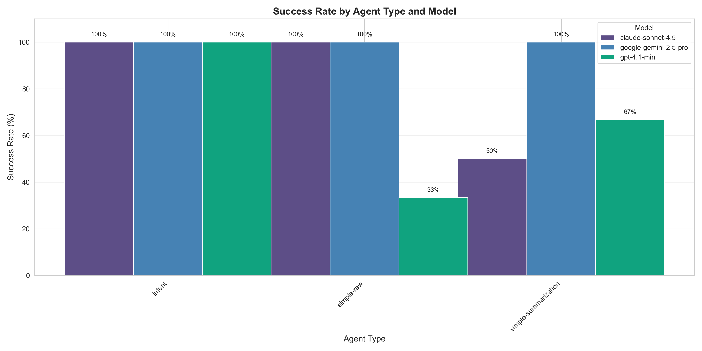

- **`intent`** (claude-sonnet-4.5): 4/4 successful (100.0%) 
- **`intent`** (google-gemini-2.5-pro): 1/1 successful (100.0%) 
- **`intent`** (gpt-4.1-mini): 3/3 successful (100.0%) 
- **`simple-raw`** (claude-sonnet-4.5): 4/4 successful (100.0%) 
- **`simple-raw`** (google-gemini-2.5-pro): 1/1 successful (100.0%) 
- **`simple-raw`** (gpt-4.1-mini): 1/3 successful (33.3%) 
- **`simple-summarization`** (claude-sonnet-4.5): 2/4 successful (50.0%) 
- **`simple-summarization`** (google-gemini-2.5-pro): 1/1 successful (100.0%) 
- **`simple-summarization`** (gpt-4.1-mini): 2/3 successful (66.7%) 

---

## Performance Metrics

### Cost Comparison

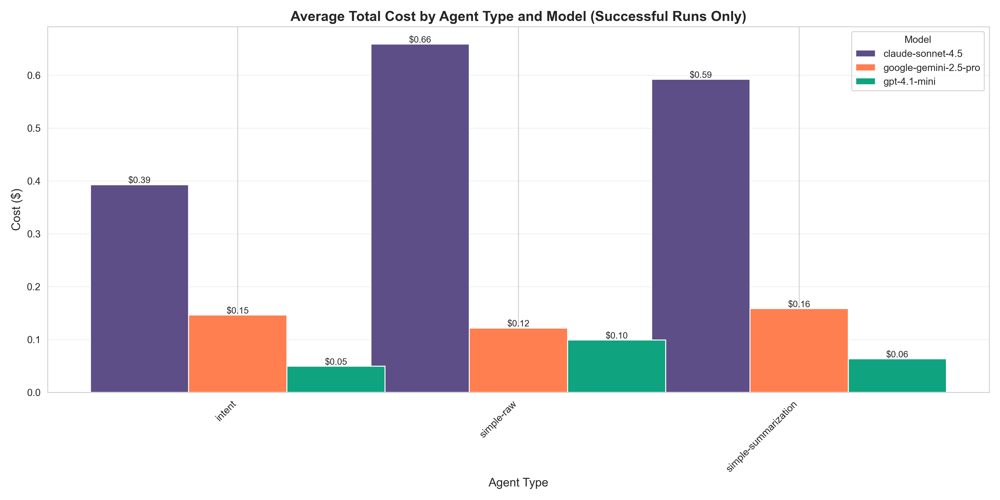

| Agent Type | Model | Average Cost | Std Dev |
|------------|-------|--------------|----------|
| `intent` | `claude-sonnet-4.5` | $0.39 | ±$0.10 |
| `intent` | `google-gemini-2.5-pro` | $0.15 | ±$nan |
| `intent` | `gpt-4.1-mini` | $0.05 | ±$0.01 |
| `simple-raw` | `claude-sonnet-4.5` | $0.66 | ±$0.21 |
| `simple-raw` | `google-gemini-2.5-pro` | $0.12 | ±$nan |
| `simple-raw` | `gpt-4.1-mini` | $0.10 | ±$nan |
| `simple-summarization` | `claude-sonnet-4.5` | $0.59 | ±$0.09 |
| `simple-summarization` | `google-gemini-2.5-pro` | $0.16 | ±$nan |
| `simple-summarization` | `gpt-4.1-mini` | $0.06 | ±$0.02 |

### Execution Time

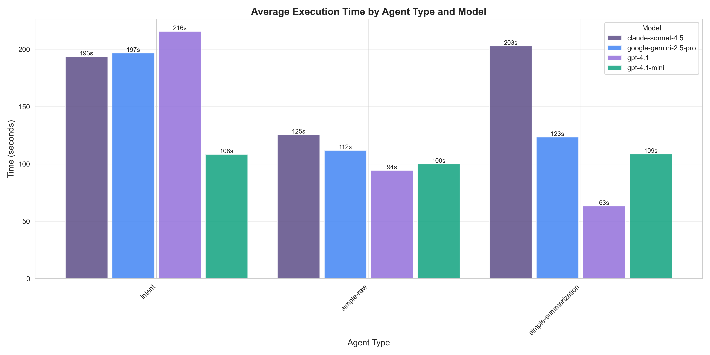

| Agent Type | Model | Average Time | Std Dev |
|------------|-------|--------------|----------|
| `intent` | `claude-sonnet-4.5` | 217.5s | ±40.8s |
| `intent` | `google-gemini-2.5-pro` | 196.7s | ±nans |
| `intent` | `gpt-4.1-mini` | 114.9s | ±24.1s |
| `simple-raw` | `claude-sonnet-4.5` | 1138.7s | ±2059.4s |
| `simple-raw` | `google-gemini-2.5-pro` | 111.9s | ±nans |
| `simple-raw` | `gpt-4.1-mini` | 96.0s | ±21.3s |
| `simple-summarization` | `claude-sonnet-4.5` | 209.0s | ±50.1s |
| `simple-summarization` | `google-gemini-2.5-pro` | 123.4s | ±nans |
| `simple-summarization` | `gpt-4.1-mini` | 117.9s | ±29.6s |

### Step Count

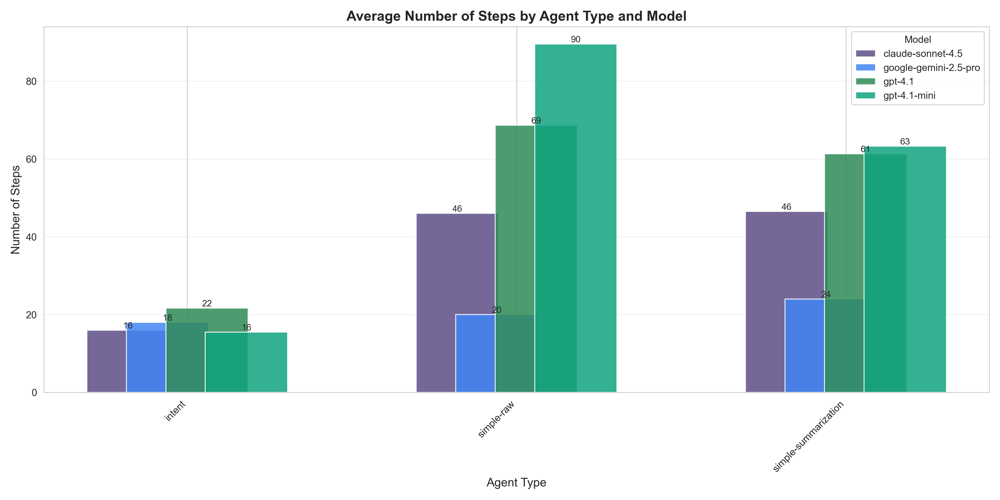

| Agent Type | Model | Average Steps | Std Dev |
|------------|-------|---------------|----------|
| `intent` | `claude-sonnet-4.5` | 18.0 | ±3.4 |
| `intent` | `google-gemini-2.5-pro` | 18.0 | ±nan |
| `intent` | `gpt-4.1-mini` | 16.0 | ±4.4 |
| `simple-raw` | `claude-sonnet-4.5` | 44.0 | ±2.8 |
| `simple-raw` | `google-gemini-2.5-pro` | 20.0 | ±nan |
| `simple-raw` | `gpt-4.1-mini` | 85.7 | ±13.9 |
| `simple-summarization` | `claude-sonnet-4.5` | 48.5 | ±3.0 |
| `simple-summarization` | `google-gemini-2.5-pro` | 24.0 | ±nan |
| `simple-summarization` | `gpt-4.1-mini` | 62.0 | ±7.0 |

### Token Usage

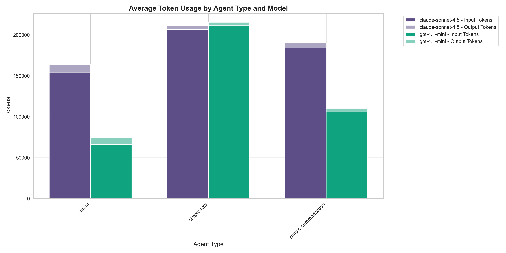

| Agent Type | Model | Input Tokens | Output Tokens | Total Tokens |
|------------|-------|--------------|---------------|-------------|
| `intent` | `claude-sonnet-4.5` | 173788 | 10587 | 184375 |
| `intent` | `google-gemini-2.5-pro` | 96056 | 18008 | 114064 |
| `intent` | `gpt-4.1-mini` | 76169 | 7637 | 83806 |
| `simple-raw` | `claude-sonnet-4.5` | 192012 | 5512 | 197523 |
| `simple-raw` | `google-gemini-2.5-pro` | 25278 | 9018 | 34296 |
| `simple-raw` | `gpt-4.1-mini` | 200453 | 4224 | 204677 |
| `simple-summarization` | `claude-sonnet-4.5` | 172418 | 6535 | 178953 |
| `simple-summarization` | `google-gemini-2.5-pro` | 32588 | 11767 | 44355 |
| `simple-summarization` | `gpt-4.1-mini` | 128154 | 4330 | 132485 |

### Tokens vs Steps Relationship

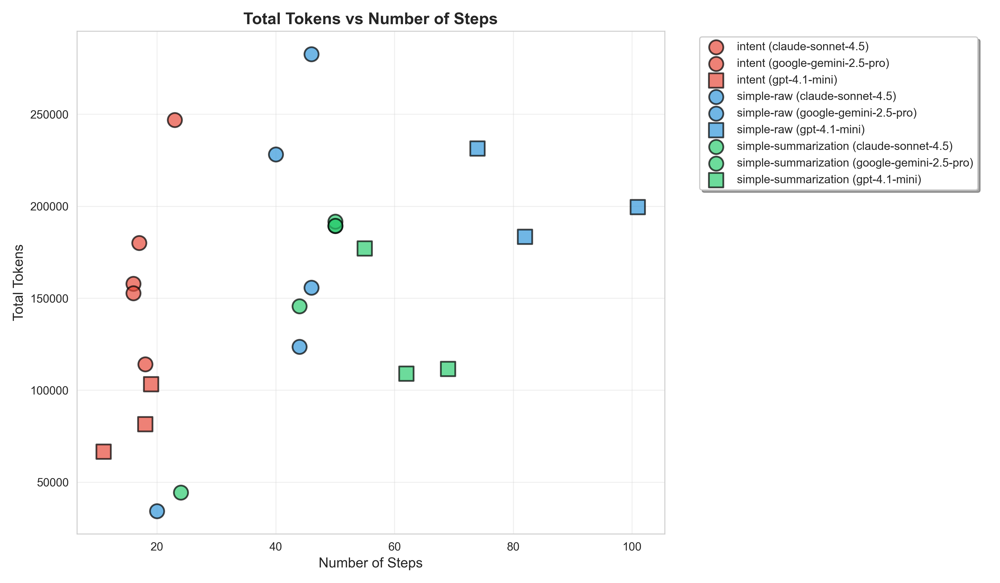

### Per-Step Latency

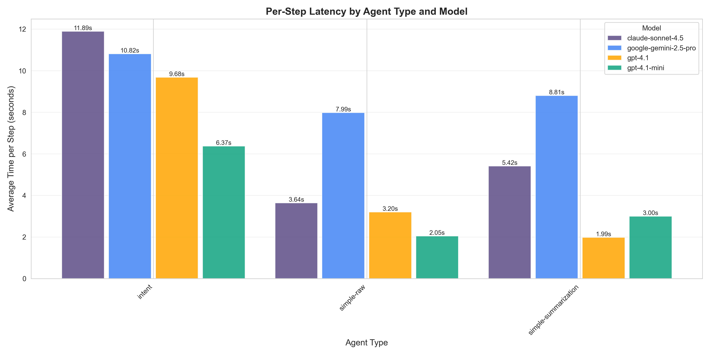

| Agent Type | Model | Avg Latency per Step | Std Dev |
|------------|-------|----------------------|----------|
| `intent` | `claude-sonnet-4.5` | 12.10s | ±1.00s |
| `intent` | `google-gemini-2.5-pro` | 10.93s | ±nans |
| `intent` | `gpt-4.1-mini` | 7.76s | ±3.35s |
| `simple-raw` | `claude-sonnet-4.5` | 24.87s | ±44.69s |
| `simple-raw` | `google-gemini-2.5-pro` | 5.59s | ±nans |
| `simple-raw` | `gpt-4.1-mini` | 1.16s | ±0.41s |
| `simple-summarization` | `claude-sonnet-4.5` | 4.27s | ±0.82s |
| `simple-summarization` | `google-gemini-2.5-pro` | 5.14s | ±nans |
| `simple-summarization` | `gpt-4.1-mini` | 1.92s | ±0.53s |

### Token Processing Throughput

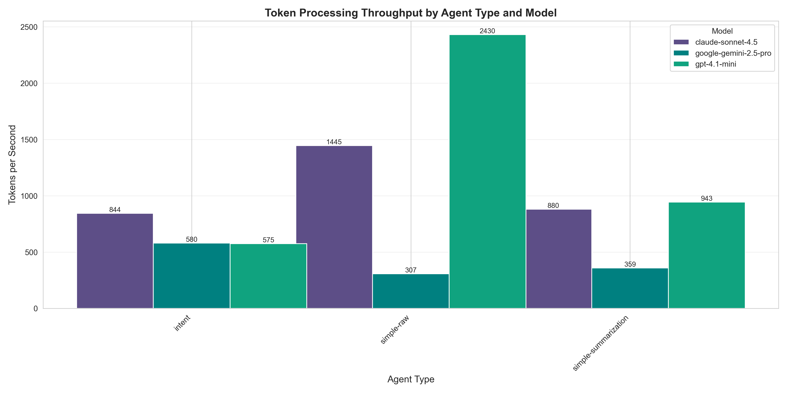

| Agent Type | Model | Tokens/Second | Std Dev |
|------------|-------|---------------|----------|
| `intent` | `claude-sonnet-4.5` | 844 | ±56 |
| `intent` | `google-gemini-2.5-pro` | 580 | ±nan |
| `intent` | `gpt-4.1-mini` | 776 | ±351 |
| `simple-raw` | `claude-sonnet-4.5` | 1445 | ±1075 |
| `simple-raw` | `google-gemini-2.5-pro` | 307 | ±nan |
| `simple-raw` | `gpt-4.1-mini` | 2202 | ±529 |
| `simple-summarization` | `claude-sonnet-4.5` | 880 | ±132 |
| `simple-summarization` | `google-gemini-2.5-pro` | 359 | ±nan |
| `simple-summarization` | `gpt-4.1-mini` | 1182 | ±470 |

### Latency vs Token Usage

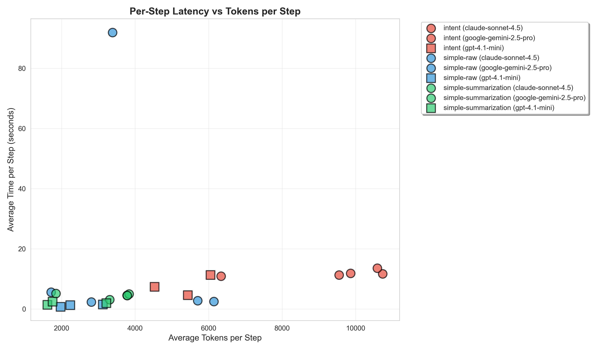

This scatter plot shows the relationship between tokens per step and latency per step, helping identify efficiency patterns across different agent configurations.

### Token Growth Scaling Analysis

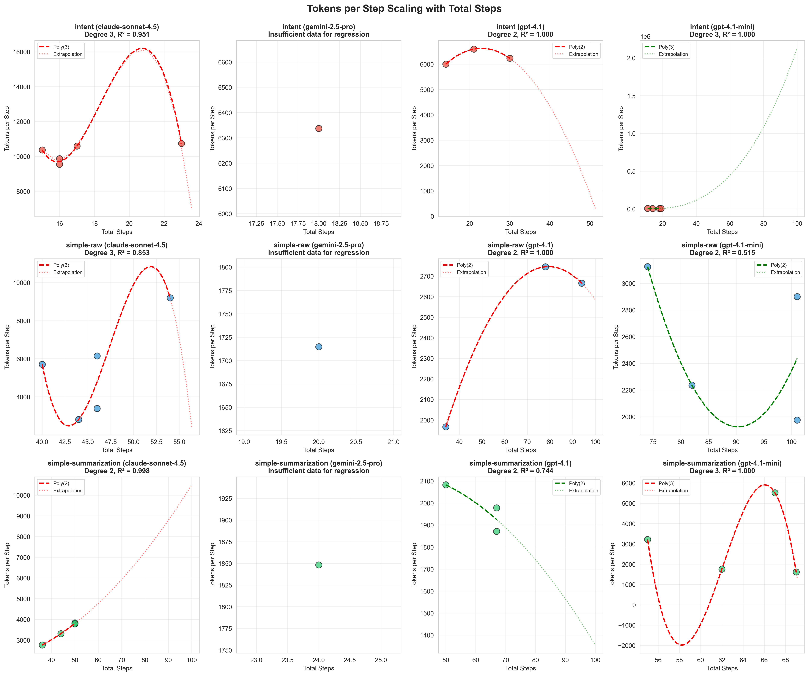

Linear regression showing how **tokens per step** changes as total steps increase. This reveals whether agents become more/less efficient with more steps. Regression lines (dashed) show the trend, dotted lines extrapolate beyond observed data.

#### Regression Parameters

| Agent Type | Model | Change Rate (Slope) | Base tokens/step | R² | tokens/step @ 100 steps |
|------------|-------|---------------------|------------------|-----|------------------------|
| `intent` | `claude-sonnet-4.5` | +125.3 | 7928 | 0.549 | 20,461 |
| `intent` | `gpt-4.1-mini` | -128.9 | 7402 | 0.539 | -5,483 |
| `simple-raw` | `claude-sonnet-4.5` | -156.0 | 11376 | 0.071 | -4,226 |
| `simple-raw` | `gpt-4.1-mini` | -37.4 | 5649 | 0.740 | 1,909 |
| `simple-summarization` | `claude-sonnet-4.5` | +81.9 | -294 | 0.991 | 7,896 |
| `simple-summarization` | `gpt-4.1-mini` | -114.3 | 9284 | 0.815 | -2,146 |

**Interpretation:**
- **Change Rate (Slope)**: How tokens/step changes with each additional step
  - Positive = getting less efficient (more tokens per step as steps increase)
  - Negative = getting more efficient (fewer tokens per step as steps increase)
  - Near zero = consistent tokens/step regardless of total steps
- **Base tokens/step (Intercept)**: Expected tokens/step at step 0
- **R²**: How well the linear model fits (1.0 = perfect fit)

#### Predicted Tokens per Step at Different Scales

| Agent Type | Model | @ 50 steps | @ 100 steps | @ 200 steps | @ 500 steps |
|------------|-------|------------|-------------|-------------|-------------|
| `intent` | `claude-sonnet-4.5` | 14,194 | 20,461 | 32,995 | 70,596 |
| `intent` | `gpt-4.1-mini` | 958 | -5,483 | -18,368 | -57,024 |
| `simple-raw` | `claude-sonnet-4.5` | 3,574 | -4,226 | -19,829 | -66,636 |
| `simple-raw` | `gpt-4.1-mini` | 3,779 | 1,909 | -1,830 | -13,050 |
| `simple-summarization` | `claude-sonnet-4.5` | 3,801 | 7,896 | 16,086 | 40,657 |
| `simple-summarization` | `gpt-4.1-mini` | 3,568 | -2,146 | -13,577 | -47,869 |

#### Predicted Total Token Usage at Different Scales

| Agent Type | Model | @ 50 steps | @ 100 steps | @ 200 steps | @ 500 steps |
|------------|-------|------------|-------------|-------------|-------------|
| `intent` | `claude-sonnet-4.5` | 709,733 | 2,046,158 | 6,599,081 | 35,298,434 |
| `intent` | `gpt-4.1-mini` | 47,947 | -548,364 | -3,673,765 | -28,512,183 |
| `simple-raw` | `claude-sonnet-4.5` | 178,714 | -422,695 | -3,965,891 | -33,318,479 |
| `simple-raw` | `gpt-4.1-mini` | 188,954 | 190,915 | -366,141 | -6,525,156 |
| `simple-summarization` | `claude-sonnet-4.5` | 190,060 | 789,630 | 3,217,297 | 20,328,523 |
| `simple-summarization` | `gpt-4.1-mini` | 178,437 | -214,658 | -2,715,452 | -23,934,654 |

### Accuracy Score

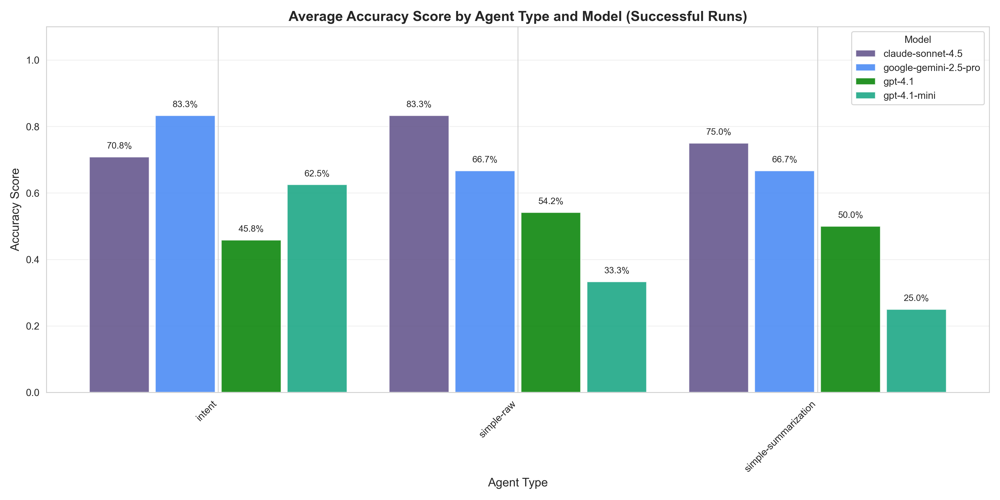

| Agent Type | Model | Average Accuracy | Std Dev |
|------------|-------|------------------|----------|
| `intent` | `claude-sonnet-4.5` | 70.83% | ±15.96% |
| `intent` | `google-gemini-2.5-pro` | 83.33% | ±nan% |
| `intent` | `gpt-4.1-mini` | 72.22% | ±34.69% |
| `simple-raw` | `claude-sonnet-4.5` | 83.33% | ±13.61% |
| `simple-raw` | `google-gemini-2.5-pro` | 66.67% | ±nan% |
| `simple-raw` | `gpt-4.1-mini` | 33.33% | ±nan% |
| `simple-summarization` | `claude-sonnet-4.5` | 83.33% | ±0.00% |
| `simple-summarization` | `google-gemini-2.5-pro` | 66.67% | ±nan% |
| `simple-summarization` | `gpt-4.1-mini` | 25.00% | ±11.79% |

### Field-Level Accuracy Analysis

#### Field Accuracy Heatmap

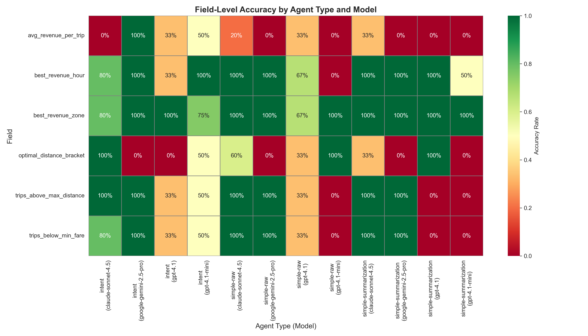

#### Proximity Score Heatmap

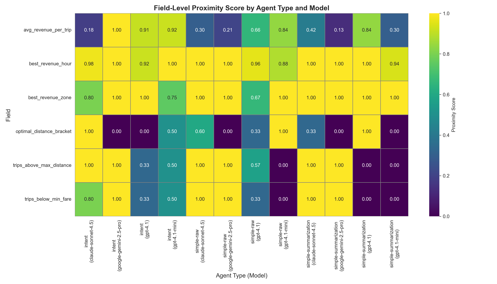

#### Field Accuracy Rates

| Field | intent (claude-sonnet-4.5) | intent (google-gemini-2.5-pro) | intent (gpt-4.1-mini) | simple-raw (claude-sonnet-4.5) | simple-raw (google-gemini-2.5-pro) | simple-raw (gpt-4.1-mini) | simple-summarization (claude-sonnet-4.5) | simple-summarization (google-gemini-2.5-pro) | simple-summarization (gpt-4.1-mini) |
|---|---|---|---|---|---|---|---|---|---|
| `avg_revenue_per_trip` | 0% | 100% | 67% | 25% | 0% | 0% | 50% | 0% | 0% |
| `best_revenue_hour` | 75% | 100% | 100% | 100% | 100% | 0% | 100% | 100% | 50% |
| `best_revenue_zone` | 75% | 100% | 67% | 100% | 100% | 100% | 100% | 100% | 100% |
| `optimal_distance_bracket` | 100% | 0% | 67% | 75% | 0% | 100% | 50% | 0% | 0% |
| `trips_above_max_distance` | 100% | 100% | 67% | 100% | 100% | 0% | 100% | 100% | 0% |
| `trips_below_min_fare` | 75% | 100% | 67% | 100% | 100% | 0% | 100% | 100% | 0% |

#### Percentage Error (Numeric Fields)

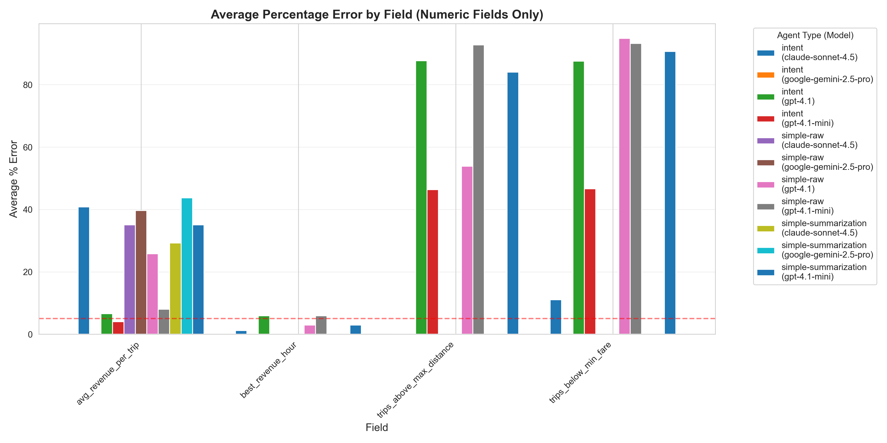

| Field | intent (claude-sonnet-4.5) | intent (google-gemini-2.5-pro) | intent (gpt-4.1-mini) | simple-raw (claude-sonnet-4.5) | simple-raw (google-gemini-2.5-pro) | simple-raw (gpt-4.1-mini) | simple-summarization (claude-sonnet-4.5) | simple-summarization (google-gemini-2.5-pro) | simple-summarization (gpt-4.1-mini) |
|---|---|---|---|---|---|---|---|---|---|
| `avg_revenue_per_trip` | 42.7% | 0.0% | 2.7% | 32.8% | 39.7% | 8.0% | 21.9% | 43.7% | 35.1% |
| `best_revenue_hour` | 1.5% | 0.0% | 0.0% | 0.0% | 0.0% | 5.9% | 0.0% | 0.0% | 2.9% |
| `trips_above_max_distance` | 0.0% | 0.0% | 30.9% | 0.0% | 0.0% | 92.7% | 0.0% | 0.0% | 84.0% |
| `trips_below_min_fare` | 13.8% | 0.0% | 31.1% | 0.0% | 0.0% | 93.2% | 0.0% | 0.0% | 90.6% |

---

## Detailed Analysis

### `intent` (openai-gpt-4.1-mini)

  

**Performance (Successful Runs Only):**

- **Average Steps:** 17.2
- **Average Cost:** $0.23
- **Average Time:** 176.4s
- **Average Tokens:** 137873
- **Tokens per Step:** 7887
- **Cost per Step:** $0.0130
- **Time per Step:** 10.33s
- **Average Accuracy:** 72.92%

### `simple-raw` (openai-gpt-4.1-mini)

  

**Performance (Successful Runs Only):**

- **Average Steps:** 45.0
- **Average Cost:** $0.48
- **Average Time:** 796.3s
- **Average Tokens:** 175939
- **Tokens per Step:** 3814
- **Cost per Step:** $0.0113
- **Time per Step:** 17.76s
- **Average Accuracy:** 72.22%

**Note:** This agent had failed runs. Check detailed metrics for more information.

### `simple-summarization` (openai-gpt-4.1-mini)

  

**Performance (Successful Runs Only):**

- **Average Steps:** 47.0
- **Average Cost:** $0.29
- **Average Time:** 153.4s
- **Average Tokens:** 133507
- **Tokens per Step:** 2793
- **Cost per Step:** $0.0068
- **Time per Step:** 3.52s
- **Average Accuracy:** 56.67%

**Note:** This agent had failed runs. Check detailed metrics for more information.

---

## Key Insights

### Rankings

#### Success Rate

🥇 **`intent`** (claude-sonnet-4.5): 100.0%  
🥈 **`intent`** (google-gemini-2.5-pro): 100.0%  
🥉 **`intent`** (gpt-4.1-mini): 100.0%  
4. **`simple-raw`** (claude-sonnet-4.5): 100.0%  
5. **`simple-raw`** (google-gemini-2.5-pro): 100.0%  
6. **`simple-summarization`** (google-gemini-2.5-pro): 100.0%  
7. **`simple-summarization`** (gpt-4.1-mini): 66.7%  
8. **`simple-summarization`** (claude-sonnet-4.5): 50.0%  
9. **`simple-raw`** (gpt-4.1-mini): 33.3%  

#### Cost Efficiency (Lower is Better)

🥇 **`intent`** (gpt-4.1-mini): $0.05  
🥈 **`simple-summarization`** (gpt-4.1-mini): $0.06  
🥉 **`simple-raw`** (gpt-4.1-mini): $0.10  
4. **`simple-raw`** (google-gemini-2.5-pro): $0.12  
5. **`intent`** (google-gemini-2.5-pro): $0.15  
6. **`simple-summarization`** (google-gemini-2.5-pro): $0.16  
7. **`intent`** (claude-sonnet-4.5): $0.39  
8. **`simple-summarization`** (claude-sonnet-4.5): $0.59  
9. **`simple-raw`** (claude-sonnet-4.5): $0.66  

#### Speed (Lower is Better)

🥇 **`simple-raw`** (gpt-4.1-mini): 111.3s  
🥈 **`simple-raw`** (google-gemini-2.5-pro): 111.9s  
🥉 **`intent`** (gpt-4.1-mini): 114.9s  
4. **`simple-summarization`** (google-gemini-2.5-pro): 123.4s  
5. **`simple-summarization`** (gpt-4.1-mini): 129.1s  
6. **`simple-summarization`** (claude-sonnet-4.5): 192.7s  
7. **`intent`** (google-gemini-2.5-pro): 196.7s  
8. **`intent`** (claude-sonnet-4.5): 217.5s  
9. **`simple-raw`** (claude-sonnet-4.5): 1138.7s  

#### Accuracy (Higher is Better)

🥇 **`intent`** (google-gemini-2.5-pro): 83.33%  
🥈 **`simple-raw`** (claude-sonnet-4.5): 83.33%  
🥉 **`simple-summarization`** (claude-sonnet-4.5): 83.33%  
4. **`intent`** (gpt-4.1-mini): 72.22%  
5. **`intent`** (claude-sonnet-4.5): 70.83%  
6. **`simple-raw`** (google-gemini-2.5-pro): 66.67%  
7. **`simple-summarization`** (google-gemini-2.5-pro): 66.67%  
8. **`simple-raw`** (gpt-4.1-mini): 33.33%  
9. **`simple-summarization`** (gpt-4.1-mini): 25.00%  

---

## Recommendations

### Best Agent for Different Use Cases

- **💰 Most Cost-Efficient:** `intent` (gpt-4.1-mini) - $0.05 per run
- **⚡ Fastest:** `simple-raw` (gpt-4.1-mini) - 111.3s per run
- **🎯 Most Accurate:** `intent` (google-gemini-2.5-pro) - 83.33% accuracy
- **✅ Most Reliable:** `intent` (claude-sonnet-4.5) - 100.0% success rate

### Overall Assessment

Based on the analysis:

The data suggests different agents excel in different areas. Choose based on your priorities:

- If **budget is critical**, prioritize the most cost-efficient agent
- If **speed is essential**, choose the fastest agent
- If **accuracy matters most**, select the most accurate agent
- If **reliability is key**, go with the highest success rate

---

*Report generated on 2025-11-07 10:17:14*
